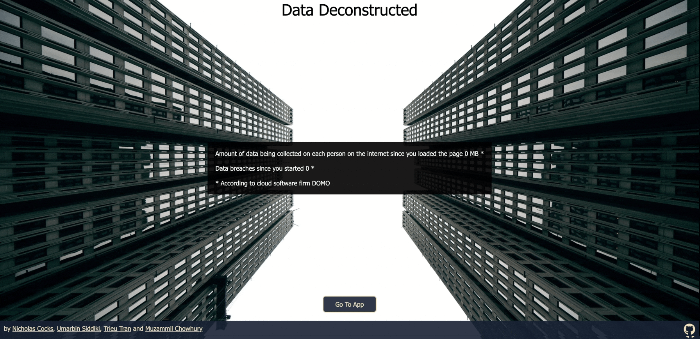

# DECONSTUCTED
Brought to you by 
+ [Nicholas Cocks](https://github.com/NicholasCocks) - Team Lead
+ [Muzammil Chowdhury](https://github.com/Muz-98) - FLEX Engineer 
+ [Trieu (JT) Tran](https://github.com/trieutrue) - Backend Engineer
+ [Umarbin Siddiki](github.com/usiddiki97) - Frontend Engineer

Check out our [Live Demo](http://deconstructed.herokuapp.com/) hosted on Heroku!

## Background and Overview
Deconstructed is an interactive web application that gets users to engage with what data is being gathered on them and empowering them to take control of their data.

Users can submit an anonymous quiz to start seeing the data types that are being gathered on them.

Logged in users have access to an additional task tracker and anonymous message board allowing them to keep track of where they want to pull their data from and share with other users about their experiences.

+ (Insert image of what main page looks like)
+ (Insert image of task component rendered)

Deconstructed is built on the MERN stack, a combination of four technologies:
+ MongoDB
+ Express
+ React
+ Node.js

## 
